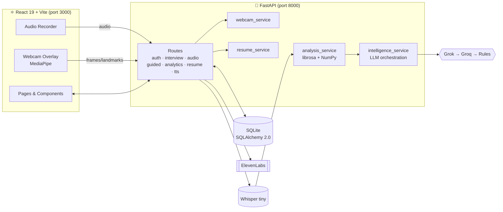
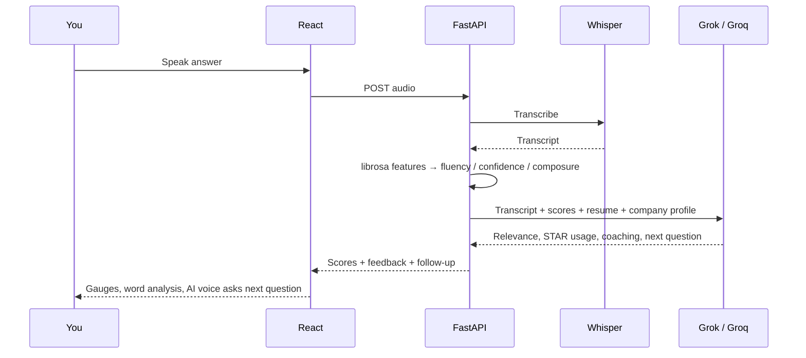
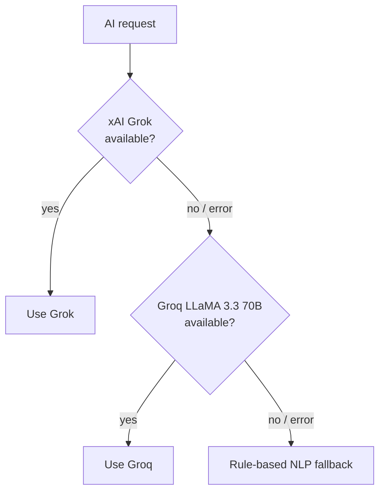

<p align="center">
  
</p>

<p align="center">
  
</p>

<p align="center">
  
  
  
  
  
  
  
</p>

<p align="center">
  <a href="#-what-i-built">What I built</a> •
  <a href="#-my-role">My role</a> •
  <a href="#-features">Features</a> •
  <a href="#%EF%B8%8F-architecture">Architecture</a> •
  <a href="#-how-the-scoring-works">Scoring</a> •
  <a href="#-getting-started">Getting started</a>
</p>

---

## 🧠 What I Built

**AI Interview Coach** is a full-stack mock-interview platform that analyses *how* you answer, not just *what* you answer.

You speak (or type) an answer → the backend transcribes it with **OpenAI Whisper**, extracts acoustic and linguistic features with **librosa**, scores **fluency, confidence and composure**, tracks **eye contact and head movement** from your webcam with **MediaPipe**, and asks an LLM to coach you and generate the next, harder question. An **ElevenLabs** voice reads questions aloud so it feels like a real interviewer.

| | |
|---|---|
| 🧩 **Scale** | 47 REST endpoints · 8 database tables · ~4.2k lines of backend Python · 30+ React components |
| 🤖 **AI stack** | Whisper (STT) · Groq LLaMA 3.3 70B · xAI Grok · ElevenLabs (TTS) · MediaPipe Face Mesh |
| 🛡️ **Resilience** | Every AI call degrades **Grok → Groq → rule-based** so the app never dead-ends |

---

## 🙋 My Role

Team project built with **M. Hannan Najeeb** and **Ameer Hamza**. I owned this repository and was responsible for:

- 🔗 **Integration & repository ownership** — merged the team's work into the final codebase, restructured the project and maintained the repo.
- 📊 **Interview analytics** — dashboard, progress and session-summary analytics end-to-end (API routes + React views).
- 🐛 **Stabilisation** — the final bug-fixing passes across backend and frontend before submission, plus UI fixes.
- 📝 **Documentation** — this README, the pitch deck and project documentation.

---

## ✨ Features

| Feature | Details |
|---|---|
| 🧭 **Guided mock interviews** | LLM generates questions for your target role, company and seniority; adapts follow-ups to your previous answer |
| 🎤 **Live practice mode** | Record an answer → transcription, scores and coaching in seconds |
| 📊 **Speech metrics** | Words-per-minute, filler words, long pauses, repetitions, hedging, type-token ratio, pitch variation, jitter & shimmer |
| 👁️ **Webcam body language** | MediaPipe Face Mesh scores eye contact and head stability; combined with voice energy into a 0–1 stress score |
| 📄 **Resume-aware** | Upload a CV (PDF parsing with a pdfplumber → PyPDF2 → pdfminer fallback chain); questions and feedback use your real background |
| 🏢 **Company modes** | 10 hand-written company profiles — Google, Meta, Amazon, Apple, Netflix, Stripe, Microsoft, McKinsey, Goldman Sachs, Deloitte |
| 🔊 **AI voice interviewer** | ElevenLabs text-to-speech reads every question |
| 📈 **Progress tracking** | Score trends, leaderboard, personalised study plan, full history |
| 🔐 **Accounts** | JWT auth with bcrypt-hashed passwords, profile & avatar management, per-key rate limiting |
| 🌌 **Polished UI** | WebGL2 curl-noise particle background, typewriter effects, magnetic buttons, dark/light theme |

---

## 🏗️ Architecture



### One answer, end to end



---

## 📐 How the Scoring Works

The speech pipeline (`analysis_service.py`) turns raw audio into three interpretable scores, each clamped to **0–1**:

```text
Fluency    = 1 − (0.3·pauseRate + 0.3·repetitionRate + 0.2·fillerRatio + 0.2·avgPause)
Confidence = 1 − (0.3·hedgeRatio + 0.2·pitchVariation + 0.2·jitter + 0.3·fillerRatio)
Composure  = 1 − (0.4·energyVariation + 0.3·longPauseRate + 0.3·pitchStd)

Overall    = 0.40·Fluency + 0.35·Confidence + 0.25·Composure
```

The LLM then adds **content scores** — relevance, content quality and STAR-method usage — so you get feedback on both delivery and substance.

### Dual-LLM fallback chain



---

## 🛠️ Tech Stack

| Layer | Technology |
|---|---|
| Frontend | React 19, Vite, Tailwind CSS 4, shadcn/ui, Framer Motion, WebGL2 |
| Backend | Python 3.10+, FastAPI, Uvicorn, Pydantic |
| Database | SQLite + SQLAlchemy 2.0 |
| Speech-to-text | OpenAI Whisper (`tiny`) |
| Audio analysis | librosa, NumPy, SciPy |
| Computer vision | MediaPipe Face Mesh, OpenCV |
| LLMs | Groq (LLaMA 3.3 70B Versatile), xAI Grok |
| Text-to-speech | ElevenLabs |
| Auth | JWT (python-jose) + bcrypt |

---

## 🚀 Getting Started

**Prerequisites:** Python 3.10+, Node.js 18+, FFmpeg, and a Groq API key (xAI and ElevenLabs keys are optional).

```bash
# 1 — Backend
cd "Ai Interview Coach/backend"
pip install -r requirements.txt
cp .env.example .env        # add your keys
python run.py               # → http://localhost:8000  (docs at /docs)

# 2 — Frontend (new terminal)
cd "Ai Interview Coach/frontend"
npm install
npm run dev                 # → http://localhost:3000
```

| Variable | Required | Purpose |
|---|:-:|---|
| `GROQ_API_KEY` | ✅ | Question generation, summaries, fallback scoring |
| `XAI_API_KEY` / `GROK_API_KEY` | ➖ | Primary answer scoring & follow-ups |
| `ELEVENLABS_API_KEY` | ➖ | AI interviewer voice |
| `JWT_SECRET_KEY` | ✅ | Signing auth tokens |
| `CORS_ORIGINS` | ➖ | Allowed frontend origins |

---

## 📂 Project Structure

```text
Ai Interview Coach/
├── backend/
│   ├── app/
│   │   ├── main.py              # FastAPI app + Whisper model loading
│   │   ├── models.py            # 8 SQLAlchemy tables
│   │   ├── routes/              # auth, interview, audio, guided_interview, analytics, resume, elevenlabs
│   │   ├── services/            # analysis, intelligence (LLMs), webcam, resume, company, audio, TTS
│   │   ├── utils/               # PDF extractor, rate limiter
│   │   └── data/swe_questions.csv   # 200-question seed bank
│   └── run.py
└── frontend/
    └── src/
        ├── pages/               # Landing, Login, Dashboard, Practice, GuidedInterview, AITools, History, Profile, Settings
        ├── components/          # WebcamOverlay, ScoreGauge, WordAnalysis, ParticleField, AiAvatar, …
        ├── context/             # Auth & Theme
        └── api/client.js
```

---

## 🔭 What I'd Improve Next

- Move from SQLite to PostgreSQL and add Alembic migrations
- Stream Whisper transcription for lower latency on long answers
- Containerise backend + frontend with Docker Compose
- Add automated tests around the scoring pipeline

---

## 👥 Team

| | |
|---|---|
| **Muhammad Ahmad** | [@ahmadmuzii](https://github.com/ahmadmuzii) |
| **M. Hannan Najeeb** | Team member |
| **Ameer Hamza** | Team member |

<p align="center"><b>One interview at a time. 🚀</b></p>

<p align="center">
  
</p>
